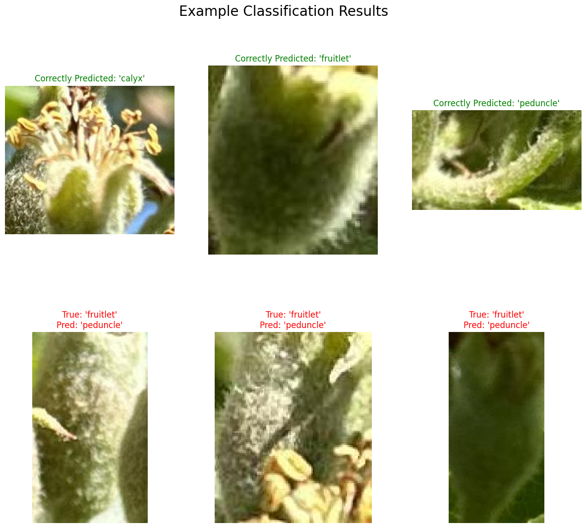

# A-Lightweight-Vision-Language-Model-for-Early-Stage-Fruitlet-Classification-in-Apple-Orchards


## Abstract

Precise localization of fine-grained anatomical structures such as calyxes, fruitlets, and peduncles is essential for informed decision-making in precision orchard management, particularly during critical early-season operations. Current deep learning-based methods, while effective, typically require substantial computational resources, limiting practical deployment. This study evaluates the feasibility of leveraging a lightweight Vision-Language Model (VLM), specifically TinyCLIP, for efficient semantic localization of apple fruitlet parts in complex orchard environments.

We collected high-resolution RGB images from commercial apple orchards (Scilate and Scifresh varieties) and systematically extracted annotated image patches using a sliding window approach and batch processing. The TinyCLIP model was fine-tuned using multilabel contrastive loss, enabling semantic alignment between image patches and natural language prompts describing each anatomical structure. Heatmap visualizations aggregated from patch-level predictions demonstrated effective localization of fruitlet structures. Deployment benchmarking confirmed efficient inference times on GPU hardware and on the Jetson Orin platform, highlighting its practical feasibility. This research demonstrates that lightweight VLMs provide an efficient, interpretable, and resource-conscious solution for localized presence detection in precision agricultural tasks.

## Table of Contents

- [Getting Started](#Getting-Started)
- [Project Structure](#project-structure)
- [Dataset](#dataset)
- [Methodology](#methodology)
- [Example Results](#example-results)
- [Usage](#usage)
- [Deployment](#deployment)
- [Citation](#citation)
- [License](#license)
- [Contributing](#contributing)

## Getting Started

### Technologies used

- Google Colab
- Jetson Orin
- TinyCLIP VLM
- Python


## Repo Structure

### GOOGLE COLAB

```

GOOGLE_COLAB/
│
├── tinyCLIP.ipynb
├── pipeline.ipynb
└── README.md
│
│
├── data/
│   ├── file_example.py
│   ├── directory_example/
│   │   ├── file_example.py
│   │   ├── file_example.py
│   │   └── file_example.py
│   │
│   ├── directory_example/
│   │   ├── file_example.py
│   │   ├── file_example.py
│   │   └── file_example.py
│   │
│   └── directory_example/
│       ├── file_example.py
│       └── file_example.py
│
├── file_example.txt
└── file_example.md
```

```
JETSON EDGE DEVICE

project-name/
│
├── directory_example/
│   ├── file_example.ipynb
│   ├── file_example.ipynb
│   ├── file_example.ipynb
│   └── directory_example/
│       ├── file_example.py
│       └── file_example.py
│
├── directory_example/
│   ├── file_example.py
│   ├── directory_example/
│   │   ├── file_example.py
│   │   ├── file_example.py
│   │   └── file_example.py
│   │
│   ├── directory_example/
│   │   ├── file_example.py
│   │   ├── file_example.py
│   │   └── file_example.py
│   │
│   └── directory_example/
│       ├── file_example.py
│       └── file_example.py
│
├── directory_example/
│   ├── directory_example/
│   ├── directory_example/
│   └── directory_example/
│
├── directory_example/
│   ├── file_example.yaml
│   └── file_example.yaml
│
├── file_example.txt
└── file_example.md
```

## Dataset

### Data Collection

**Orchard Varieties:**
- **Scilate**: [Brief description of variety and collection details]
- **Scifresh**: [Brief description of variety and collection details]

**Image Specifications:**
- Format: High-resolution RGB images
- Collection environment: Commercial apple orchards
- Target structures: Calyxes, fruitlets, peduncles
- Annotation method: [Details about annotation process]

### Data Preprocessing

- **Patch Extraction**: Sliding window approach for systematic patch generation
- **Batch Processing**: Efficient processing of large-scale orchard imagery
- **Annotation Strategy**: [Details about multilabel annotation approach]

## Methodology

### Model Architecture

**TinyCLIP Framework:**
- Lightweight Vision-Language Model optimized for resource-constrained deployment
- Semantic alignment between visual patches and natural language descriptions
- Efficient architecture suitable for edge computing platforms

### Training Strategy

**Loss Function:**
- Multilabel contrastive loss for fine-grained structure localization
- Optimization for semantic alignment between image patches and text prompts

**Fine-tuning Approach:**
- [Details about transfer learning strategy]
- [Hyperparameter optimization details]
- [Training data distribution and sampling strategy]

### Localization Pipeline

1. **Patch-level Prediction**: Individual patch classification for anatomical structures
2. **Heatmap Aggregation**: Spatial aggregation of patch-level predictions
3. **Structure Localization**: Final localization through heatmap analysis

### Deployment Optimization

**Target Platforms:**
- GPU hardware for development and validation
- Jetson Orin for edge deployment in orchard environments
- Optimization techniques for real-time inference

## Example Results

### Performance Metrics in Google Colab T4 GPU using PyTorch model

This is for single image patch inference(224 x 224 pixel patch)

| Structure Type | Precision | Recall | F1-Score | Inference Time (ms) |
|---------------|-----------|--------|----------|-------------------|
| Calyxes       | 0.9639     | 0.9412  | 0.9524    | [TBD]            |
| Fruitlets     | 0.9881     | 0.9765  | 0.9822    | [TBD]            |
| Peduncles     | 0.9844     | 0.7500  | 0.8514    | [TBD]            |

### Performance Metrics on Jetson Orin using TRT engine(fp16)

This is for single image patch inference(224 x 224 pixel patch)

| Structure Type | Precision | Recall | F1-Score | Inference Time (ms) |
|---------------|-----------|--------|----------|-------------------|
| Calyxes       | 0.9639     | 0.9412  | 0.9524    | [TBD]            |
| Fruitlets     | 0.9881     | 0.9765  | 0.9822    | [TBD]            |
| Peduncles     | 0.9844     | 0.7500  | 0.8514    | [TBD]            |


### Performance Metrics on Jetson Orin using TRT engine(int8)

This is for single image patch inference(224 x 224 pixel patch)

| Structure Type | Precision | Recall | F1-Score | Inference Time (ms) |
|---------------|-----------|--------|----------|-------------------|
| Calyxes       | 0.9750     | 0.9176  | 0.9455    | [TBD]            |
| Fruitlets     | 0.9765     | 0.9765  | 0.9765     | [TBD]            |
| Peduncles     | 1.0000    | 0.6786  | 0.8085    | [TBD]            |


### Sample Visualizations




#### Original Images vs. Localization Heatmaps

**Scilate Variety:**
```
[Placeholder for sample images and corresponding heatmaps]
- Original orchard image
- Generated heatmap overlay
- Detected structure locations
```

**Scifresh Variety:**
```
[Placeholder for sample images and corresponding heatmaps]
- Original orchard image
- Generated heatmap overlay
- Detected structure locations
```

### Deployment Benchmarks

#### Inference Performance

| Platform    | Model Size | Inference Time | Memory Usage |
|------------|------------|----------------|--------------|
| COLAB T4 GPU   | [TBD]      | [TBD] ms      | [TBD] MB     |
| Jetson Orin| [TBD]      | [TBD] ms      | [TBD] MB     |

#### Comparison with Baseline Methods

```
[Placeholder for comparative analysis charts]
- Accuracy vs. computational efficiency trade-offs
- Resource utilization comparisons
- Real-time performance metrics
```


## Acknowledgments

- [Funding sources]
- [Orchard partners for data collection]
- [Technical collaborators]
- [Open-source libraries and frameworks used]

---

**Contact**: [Your contact information]  
